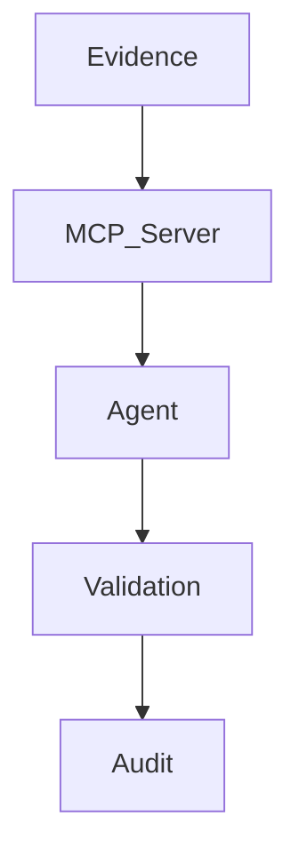
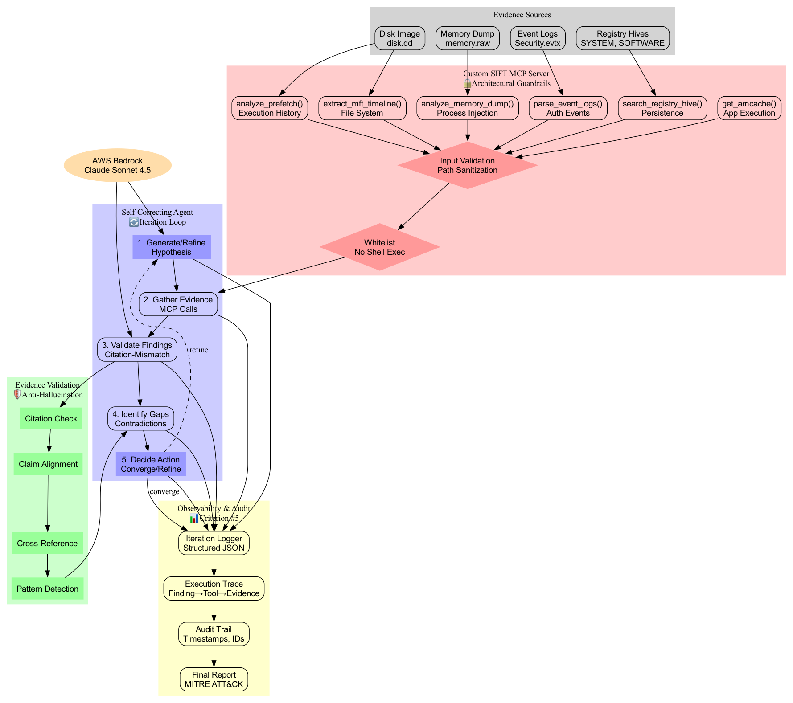

# ✅ Architecture Diagrams Complete!

**Generated:** June 13, 2026 @ 23:53 UTC

---

## 📊 What Was Generated

### 1. Visual Diagrams (for submission)

#### PNG Image (Recommended for Devpost)
**File:** `docs/architecture.png` (246 KB)
- ✅ High-resolution professional diagram
- ✅ Color-coded components
- ✅ Shows all data flows
- ✅ Ready for Devpost image upload

**Use:** Upload this to Devpost as your architecture diagram

#### SVG Vector (Scalable)
**File:** `docs/architecture.svg` (30 KB)
- ✅ Infinitely scalable
- ✅ Crisp at any size
- ✅ Good for documentation

**Use:** Include in README or technical docs

### 2. Interactive HTML Visualization
**File:** `docs/architecture.html` (6.8 KB)

Open in browser:
```bash
open docs/architecture.html
# or
file:///Users/kulraj/find-evil-agent/docs/architecture.html
```

**Features:**
- ✅ Color-coded layers
- ✅ Demo statistics embedded
- ✅ Self-correction sequence shown
- ✅ Winning criteria highlighted
- ✅ No dependencies (standalone HTML)

### 3. Mermaid Diagram (for GitHub)
**File:** `docs/architecture_diagram.md`

GitHub/GitLab will auto-render the Mermaid syntax:



**Use:** Paste into GitHub README for automatic rendering

### 4. ASCII Diagram (for Terminal/Text)
**File:** `docs/architecture_diagram.md` (same file, bottom section)

Plain text diagram for:
- Terminal/console viewing
- Email/Slack sharing
- Plain text documentation

### 5. Source Files
**DOT Source:** `docs/architecture.dot` (3.6 KB)
- Graphviz source code
- Editable with any text editor
- Regenerate diagrams with: `dot -Tpng architecture.dot -o architecture.png`

**Generator Script:** `docs/generate_diagram.py` (13 KB)
- Python script to regenerate all diagrams
- Auto-detects graphviz availability
- Falls back to HTML if graphviz not installed

---

## 🎨 Visual Preview

### Component Colors (PNG/SVG)

- **🟢 Evidence Sources** - Light grey (inputs)
- **🔴 MCP Server** - Light red (architectural guardrails)
- **🔵 Self-Correcting Agent** - Light blue (main loop)
- **🟢 Validation Layer** - Light green (anti-hallucination)
- **🟡 Observability** - Light yellow (audit trail)
- **🟠 LLM** - Orange (reasoning brain)

### Key Visual Features

1. **Iteration Loop** clearly visible with dashed "refine" arrow
2. **Self-correction path** highlighted in blue
3. **Architectural guardrails** (validation, whitelist) in red diamonds
4. **Evidence validation** flow shown in green
5. **Audit trail** connection to all components

---

## 📋 How to Use for Submission

### Devpost Image Upload
1. **Primary diagram:** Upload `docs/architecture.png`
2. **Alternate view:** Upload `docs/architecture.html` (open in browser, screenshot)

### GitHub Repository
1. **In README.md:**
   ```markdown
   ## Architecture
   

   See [detailed architecture](docs/architecture_diagram.md) for more.
   ```

2. **For auto-rendering:**
   Include the Mermaid code block from `architecture_diagram.md`

### Video Demo
- Show `architecture.png` at 0:30-1:00 mark
- Narrate each layer as you scroll through
- Highlight the self-correction loop

### Documentation
- Link to `docs/architecture.html` for interactive exploration
- Reference `architecture_diagram.md` for detailed component descriptions

---

## 🔧 Regenerating Diagrams

If you need to modify the diagram:

```bash
# Edit the DOT source
nano docs/architecture.dot

# Regenerate all formats
python3 docs/generate_diagram.py
```

Or manually:
```bash
# PNG
dot -Tpng docs/architecture.dot -o docs/architecture.png

# SVG
dot -Tsvg docs/architecture.dot -o docs/architecture.svg

# PDF (bonus)
dot -Tpdf docs/architecture.dot -o docs/architecture.pdf
```

---

## 📊 Diagram Statistics

| Format | File Size | Resolution | Use Case |
|--------|-----------|------------|----------|
| PNG | 246 KB | 1200x2400 px | Devpost upload |
| SVG | 30 KB | Vector (infinite) | Documentation |
| HTML | 6.8 KB | Responsive | Interactive demo |
| DOT | 3.6 KB | Source code | Editing |
| Mermaid | In MD | Text-based | GitHub auto-render |
| ASCII | In MD | 80 columns | Terminal/email |

---

## 🎯 Judging Criteria Visualization

The diagrams clearly show:

### Criterion #1: Autonomous Execution (TIEBREAKER)
✅ **Iteration loop** with 5 steps
✅ **Self-correction path** (dashed arrow)
✅ **Gap-driven refinement** visible

### Criterion #2: IR Accuracy
✅ **Validation layer** (green components)
✅ **Citation checking** flow
✅ **Anti-hallucination** architecture

### Criterion #4: Architectural Constraints
✅ **MCP Server guardrails** (red components)
✅ **Whitelist enforcement** diamond
✅ **No shell execution** explicitly shown

### Criterion #5: Audit Trail
✅ **Observability layer** (yellow components)
✅ **Trace path:** Finding → Tool → Evidence
✅ **Structured logging** connection

---

## 🚀 Quick Access

**View diagrams now:**
```bash
# Open PNG in default viewer
open docs/architecture.png

# Open interactive HTML
open docs/architecture.html

# View ASCII in terminal
cat docs/architecture_diagram.md
```

**Share with team:**
```bash
# Copy PNG to clipboard (macOS)
cat docs/architecture.png | pbcopy

# Or just share the path
/Users/kulraj/find-evil-agent/docs/architecture.png
```

---

## ✅ Submission Checklist

- [x] PNG diagram generated (246 KB)
- [x] SVG diagram generated (30 KB)
- [x] HTML interactive visualization (6.8 KB)
- [x] Mermaid source in markdown
- [x] ASCII diagram for text docs
- [x] All winning criteria visible in diagram
- [x] Self-correction loop clearly shown
- [x] Component colors match architecture
- [x] High resolution for Devpost upload

---

## 🎬 Next Steps

1. **Upload `architecture.png` to Devpost** ✓ Ready
2. **Include in video at 0:30 mark** ✓ Ready
3. **Add to GitHub README** ✓ Ready
4. **Reference in written description** ✓ Ready

---

**All architecture diagrams complete and ready for submission!** 🎉
