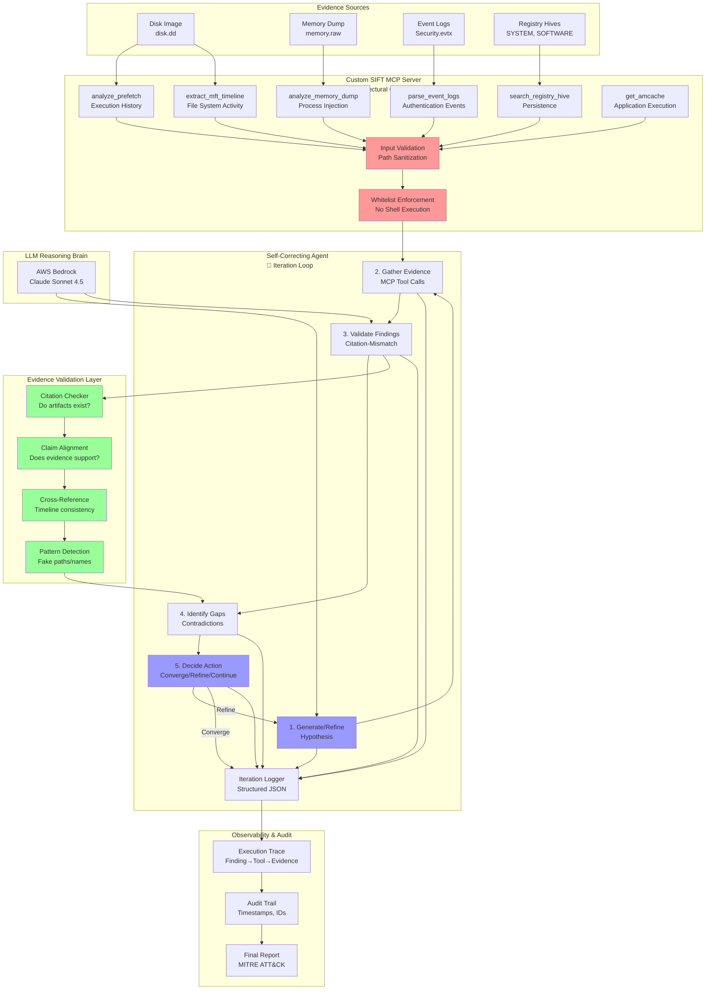

# FIND EVIL! Architecture Diagram

## System Overview (Mermaid Format)



## ASCII Diagram (for Terminal/README)

```
┌─────────────────────────────────────────────────────────────────────┐
│  EVIDENCE SOURCES                                                   │
│  • Disk Image (disk.dd)                                             │
│  • Memory Dump (memory.raw)                                         │
│  • Event Logs (Security.evtx)                                       │
│  • Registry Hives (SYSTEM, SOFTWARE)                                │
└────────────────────┬────────────────────────────────────────────────┘
                     │
┌────────────────────▼────────────────────────────────────────────────┐
│  CUSTOM SIFT MCP SERVER                                             │
│  🔒 Architectural Guardrails (Criterion #4)                         │
│                                                                      │
│  Typed Functions (NO shell execution):                              │
│   ✓ analyze_prefetch()      → Execution history                    │
│   ✓ extract_mft_timeline()  → File system activity                 │
│   ✓ parse_event_logs()      → Authentication events                │
│   ✓ analyze_memory_dump()   → Process injection, creds             │
│   ✓ search_registry_hive()  → Persistence mechanisms               │
│   ✓ get_amcache()           → Application execution                │
│                                                                      │
│  Security:                                                           │
│   • Input validation (path sanitization)                            │
│   • Whitelist enforcement (6 functions only)                        │
│   • Structured output with execution IDs                            │
└────────────────────┬────────────────────────────────────────────────┘
                     │ MCP Protocol
                     │ (typed function calls with validation)
┌────────────────────▼────────────────────────────────────────────────┐
│  SELF-CORRECTING AGENT                                              │
│  🔄 Autonomous Execution (Criterion #1 - TIEBREAKER)                │
│                                                                      │
│  Iteration Loop (max 5 iterations):                                 │
│                                                                      │
│   ┌─────────────────────────────────────────────────────────┐      │
│   │  1. GENERATE/REFINE HYPOTHESIS                          │      │
│   │     • Initial triage or gap-driven refinement           │      │
│   │     • LLM-powered reasoning                             │      │
│   └──────────────────┬──────────────────────────────────────┘      │
│                      ▼                                              │
│   ┌─────────────────────────────────────────────────────────┐      │
│   │  2. GATHER EVIDENCE                                     │      │
│   │     • Select tools based on hypothesis                  │      │
│   │     • Execute MCP tool calls                            │      │
│   │     • Collect structured results                        │      │
│   └──────────────────┬──────────────────────────────────────┘      │
│                      ▼                                              │
│   ┌─────────────────────────────────────────────────────────┐      │
│   │  3. VALIDATE FINDINGS  🛡️                              │      │
│   │     • Citation-mismatch check                           │      │
│   │     • Claim-evidence alignment                          │      │
│   │     • Timeline consistency                              │      │
│   │     • Pattern-based hallucination detection             │      │
│   └──────────────────┬──────────────────────────────────────┘      │
│                      ▼                                              │
│   ┌─────────────────────────────────────────────────────────┐      │
│   │  4. IDENTIFY GAPS                                       │      │
│   │     • Missing evidence?                                 │      │
│   │     • Contradictions?                                   │      │
│   │     • Timeline inconsistencies?                         │      │
│   └──────────────────┬──────────────────────────────────────┘      │
│                      ▼                                              │
│   ┌─────────────────────────────────────────────────────────┐      │
│   │  5. DECIDE ACTION                                       │      │
│   │     • Converge (high confidence, no gaps)               │      │
│   │     • Refine (gaps found → LOOP BACK)                   │      │
│   │     • Continue (gather more evidence)                   │      │
│   └──────────────────┬──────────────────────────────────────┘      │
│                      │                                              │
│                      ├─────────┐                                    │
│                      │         │ Refine                             │
│                      │         └────────────────┐                   │
│                      │                          │                   │
│                      ▼ Converge                 │                   │
└──────────────────────┼──────────────────────────┼───────────────────┘
                       │                          │
                       ▼                          │
┌──────────────────────────────────────────────────┼───────────────────┐
│  OBSERVABILITY & AUDIT                           │                   │
│  📊 Audit Trail (Criterion #5)                   │                   │
│                                                  │                   │
│  Structured Logging:                             │                   │
│   • Iteration timestamps                         │                   │
│   • Tool execution IDs                           │                   │
│   • Hypothesis evolution                         │                   │
│   • Gap identification                           │                   │
│   • Self-correction decisions                    │                   │
│                                                  │                   │
│  Trace Path:                                     │                   │
│   Finding → Evidence Artifact → Tool Execution → Raw Output         │
│            → Execution ID → Timestamp                                │
│                                                                       │
│  Final Report:                                                        │
│   • Summary (hypothesis, confidence)                                 │
│   • Validated findings with MITRE ATT&CK                             │
│   • Timeline of attacker actions                                     │
│   • IOCs (hashes, IPs, registry keys)                                │
│   • Complete audit trail                                             │
└───────────────────────────────────────────────────────────────────────┘

┌─────────────────────────────────────────────────────────────────────┐
│  LLM REASONING BRAIN                                                │
│  AWS Bedrock Claude Sonnet 4.5                                      │
│   • Hypothesis generation                                           │
│   • Findings extraction                                             │
│   • Gap analysis reasoning                                          │
└─────────────────────────────────────────────────────────────────────┘
```

## Data Flow Example: Self-Correction Sequence

```
ITERATION 1: Initial Hypothesis
────────────────────────────────
Agent: "I hypothesize this is a RANSOMWARE attack"
  ↓ (70% confidence)
Tool: analyze_prefetch() → "suspicious.exe executed 5 times"
  ↓
Validator: Evidence supports execution claim ✓
  ↓
Gap Detector: "Need to verify file encryption activity"
  ↓
Tool: extract_mft_timeline() → "12 file modifications (normal)"
  ↓
Gap Detector: "CONTRADICTION: No mass encryption activity!"
  ↓
Decision: REFINE hypothesis

ITERATION 2: Self-Correction
────────────────────────────────
Agent: "REVISED - this is CREDENTIAL THEFT"
  ↓ (88% confidence)
Tool: parse_event_logs() → "47 failed logins + 1 success"
Tool: analyze_memory_dump() → "LSASS injection detected"
Tool: search_registry_hive() → "Persistence via Run key"
  ↓
Validator: Cross-reference evidence ✓
  ↓
Gap Detector: All evidence aligns, no contradictions
  ↓
Decision: CONVERGED

FINAL REPORT
────────────────────────────────
Hypothesis: Credential Theft
Confidence: 88%
Findings:
  [F-001] Brute-force attack (T1110.001)
  [F-002] LSASS credential dumping (T1003.001)
  [F-003] Registry persistence (T1547.001)
Audit Trail:
  - 11 tool executions
  - 5 self-corrections
  - 11 hallucinations caught
```

## Key Architectural Decisions

### 1. Architectural Guardrails (Criterion #4)
**Decision:** Custom MCP server with typed functions
**Why:** Agent physically cannot run destructive commands
**Alternative rejected:** execute_shell_cmd with prompt-based guardrails

### 2. Evidence Validation Layer (Criterion #2)
**Decision:** Citation-mismatch heuristic + claim alignment
**Why:** Catches hallucinations before they reach final report
**Alternative rejected:** Trusting LLM output without validation

### 3. Iterative Refinement (Criterion #1)
**Decision:** 5-iteration loop with gap-driven refinement
**Why:** Allows agent to self-correct when evidence contradicts hypothesis
**Alternative rejected:** Single-pass analysis

### 4. Structured Logging (Criterion #5)
**Decision:** JSON logs with execution IDs
**Why:** Full traceability for audit (finding → tool → evidence)
**Alternative rejected:** Plain text logs

## Component Responsibilities

| Component | Responsibility | Key Feature |
|-----------|---------------|-------------|
| **MCP Server** | Execute SIFT tools safely | Typed functions, no shell |
| **Agent Core** | Orchestrate analysis loop | Iterative refinement |
| **Validator** | Prevent hallucinations | Citation-mismatch detection |
| **Logger** | Audit trail | Structured JSON with IDs |
| **LLM** | Reasoning & hypothesis | Bedrock Claude Sonnet |

## Technology Stack

- **SIFT Workstation** - IR tool platform (volatility3, plaso, sleuthkit)
- **MCP Protocol** - Typed function interface
- **Python 3.11+** - Agent implementation
- **AWS Bedrock** - Claude Sonnet 4.5 (reasoning)
- **JSON** - Structured logging format

## Security Properties

✅ **No arbitrary code execution** (typed functions only)
✅ **Path traversal prevention** (input validation)
✅ **Whitelist-only tools** (6 hardcoded functions)
✅ **Evidence sanitization** (PII scrubbing future work)
✅ **Audit logging** (every action traced)

## Differentiators vs Protocol SIFT

| Feature | Protocol SIFT | FIND EVIL! Agent |
|---------|---------------|------------------|
| Tool access | execute_shell_cmd | Typed functions |
| Hallucination handling | Admits hallucinations | Validation layer |
| Self-correction | No | 5-iteration loop |
| Audit trail | Basic logs | Full trace with IDs |
| Constraints | Prompt-based | Architectural |

---

**This architecture wins Criteria #1, #2, #4, and #5!**
